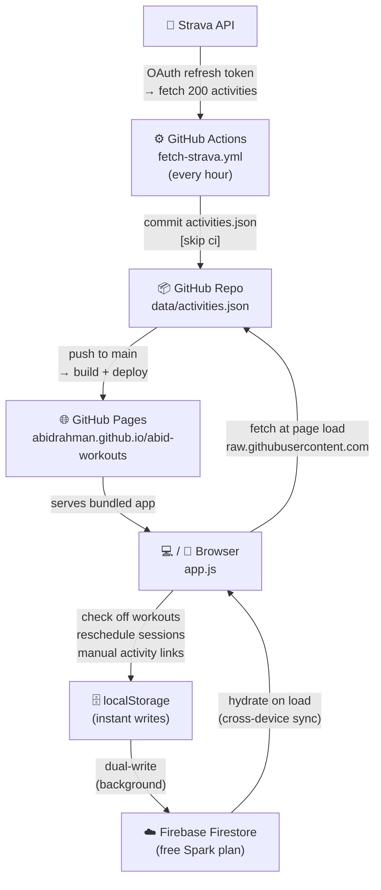

# Abid Workouts

A personal web app for tracking my training blocks.

**Current block: Fall 2026 base — Sep 21 to Dec 31, 2026 (15 weeks).**

The priorities, in order:

1. **Swim** — break a plateau by replacing open rest with fixed send-offs built off
   Critical Swim Speed, adding a 4th weekly session, and holding a 6,000 yd/wk floor
   through every travel week. Volume ramps 6,200 → 9,500 yd/wk.
2. **Run** — rebuild from ~5 km/wk to an 8 km race (Redmond Reindeer Romp 5 mile,
   Dec 5) without re-triggering shin splints or CECS. One run per week until the
   custom orthotics arrive, then a capped ramp.
3. **Strength + mobility** — two lifting days a week aimed at the posterior chain,
   single-leg strength, and the soleus/tibialis work that keeps the lower legs quiet.
4. **Bike** — 2–3 sessions a week, moving indoors to the Keiser M3i as winter lands.

It feeds into the January 2027 Victoria 70.3 build. The whole rationale lives in the
app's **The Plan** tab; the week-by-week schedule lives in `plan.js`.

## Hosted

```
https://abidrahman.github.io/abid-workouts/
```

## Data flow



## Requirements

- Node.js `20.19+`
- npm

## Getting started

```bash
npm install
npm run dev        # local dev server at http://127.0.0.1:5173/
npm run dev:lan    # accessible on LAN (for mobile testing)
```

## Build

```bash
npm run build      # outputs to dist/
npm run preview    # preview production build locally
```

## Project structure

```
.
├── .github/workflows/
│   ├── deploy-pages.yml   # deploys dist/ to GitHub Pages on push to main
│   ├── ci.yml             # build check on PRs
│   └── fetch-strava.yml   # fetches Strava activities hourly → data/activities.json
├── backend/               # Firebase config and Firestore rules
├── data/
│   └── activities.json    # auto-updated hourly by fetch-strava workflow
├── scripts/
│   ├── build.mjs          # production build (esbuild bundle)
│   ├── dev-server.mjs     # local dev server
│   ├── fetch-strava.mjs   # Strava API fetch script (run by GitHub Actions)
│   ├── export-plan.mjs    # plan.js → plan-export.json (self-validating)
│   └── build-plan-xlsx.py # plan-export.json → the .xlsx tracker
├── plan.js                # the training block: phases, weekly sessions, swim/run/strength data
├── app.js                 # main app logic
├── app-api.js             # Firebase/Firestore sync layer
├── index.html             # app shell
├── styles.css             # styles
└── package.json
```

## Spreadsheet tracker

`Abid — Fall 2026 Training Block.xlsx` is the same block as a workbook, generated
*from* `plan.js` so the two can never drift:

```bash
npm run plan:xlsx   # requires python + `pip install openpyxl`
```

Six sheets: **Log** (all 191 sessions, one row each — the only sheet you type into),
**Week Summary** (SUMIFS rollups, incl. the 6,000 yd/week floor indicator),
**Swim** (CSS test log, pace zones, send-offs, drill progression), **Run** (ramp +
lower-leg protocol), **Strength** (load tracking per template per week), and
**Reference**. Blue cells are inputs, black cells are formulas.

To use it in Google Sheets: upload to Drive and open with Sheets, or
**File → Import → Upload**. Formulas, dropdowns, and conditional formatting carry
over; spot-check the `m:ss` cells on the Swim sheet after importing.

## Features

- **Calendar** — check off workouts, reschedule sessions via drag-and-drop
- **The Plan** — phases, swim methodology, pace zones and send-offs, drill progression,
  weekly swim volume, the run ramp, HR zones, the lower-leg protocol, and strength templates
- **Strava sync** — activities fetched hourly via GitHub Actions, auto-matched to planned workouts
- **Strength logging** — per-exercise set/rep/weight logging with history
- **Cross-device sync** — progress synced via Firebase Firestore (free Spark plan)

## GitHub Actions secrets required

For the Strava fetch workflow to work, add these to the repo secrets:

| Secret | Description |
|---|---|
| `STRAVA_CLIENT_ID` | From https://www.strava.com/settings/api |
| `STRAVA_CLIENT_SECRET` | From https://www.strava.com/settings/api |
| `STRAVA_REFRESH_TOKEN` | OAuth refresh token with `activity:read_all` scope |

## Progress storage

Progress is stored in `localStorage` (instant) and synced to Firestore in the background. Data persists across devices using a stable user ID stored in `localStorage`.

## Changing the plan

The training block is data, not markup. Everything lives in `plan.js`:

| Export | What it drives |
|---|---|
| `blockMeta` | Block start/end dates and the goal race |
| `phases`, `summaryCards`, `weekTargets` | The Plan tab's overview |
| `planWeeks` | The week-by-week schedule — the source of truth for the calendar |
| `plannedSessionsByDate` | Derived `YYYY-MM-DD` → sessions map the calendar reads |
| `swimPaceZones`, `swimSendOffs`, `swimDrillProgression` | Swim prescriptions |
| `runRamp`, `lowerLegProtocol` | Run volume table and injury guardrails |
| `strengthTemplates` | The two lifting days |

To start a new block, rewrite `planWeeks` and update `calendarStartDate` /
`calendarEndDate` in `app.js`. Session objects look like:

```js
{
  title: "Swim — threshold 10 × 100",
  duration: "2,200 yd · 49–65 min",   // both the yardage and the minutes are parsed
  categories: ["swim"],               // swim | run | bike | strength | hike | recovery
  note: "Warm-up 400. Drill 400. Main: 10 × 100 at CSS on 2:15…",
  rescheduleLocked: true,             // optional — pins a race to its date
}
```
